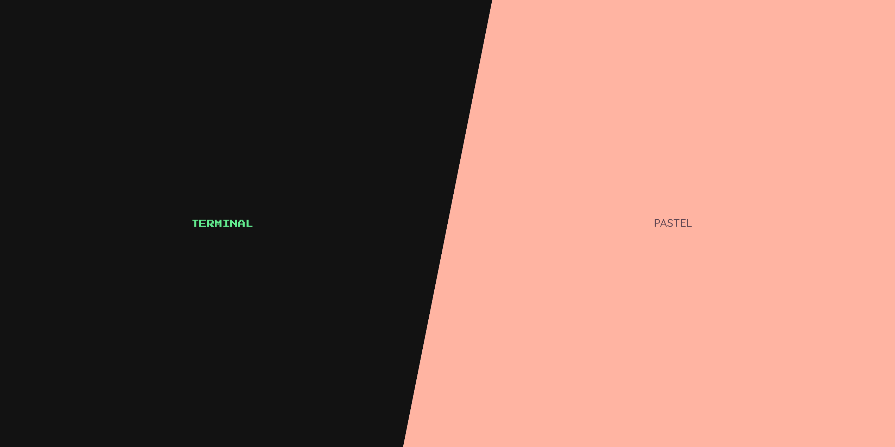

# My Portfolio Website!

This is my personal [portfolio website](https://thibaulthenry.com/) showcasing my professional background and experience. The site features a unique dual-interface design that allows visitors to choose their preferred experience:

- **Terminal Interface**: A retro command-line experience for tech enthusiasts
- **Pastel Interface**: A modern, clean design with a soft pastel color scheme

## Features

- Two distinct user experiences in one site
- Seamless switching between interfaces
- Clean and modern interface in pastel mode
- Authentic terminal experience in CLI mode
- Easy navigation between sections

## Sections

- About Me - Professional background and introduction
- Experience - Work history and key accomplishments  
- Skills - Technical and professional competencies
- Projects - Showcase of notable work
- Contact - Ways to get in touch
- and more!

## Technologies Used

- HTML5
- CSS3 (with CSS variables for theming)
- JavaScript (vanilla)
- Mobile & tablet responsive design
- Hostinger

## Interface Modes

### Terminal Mode
- Command-line interface
- Keyboard navigation
- Classic terminal commands
- Retro aesthetic

### Pastel Mode
- Modern visual interface
- Soft color palette
- Point-and-click navigation
- Smooth transitions

## License

This project is licensed under the Unlicense. See the [LICENSE](LICENCE) file for details.
